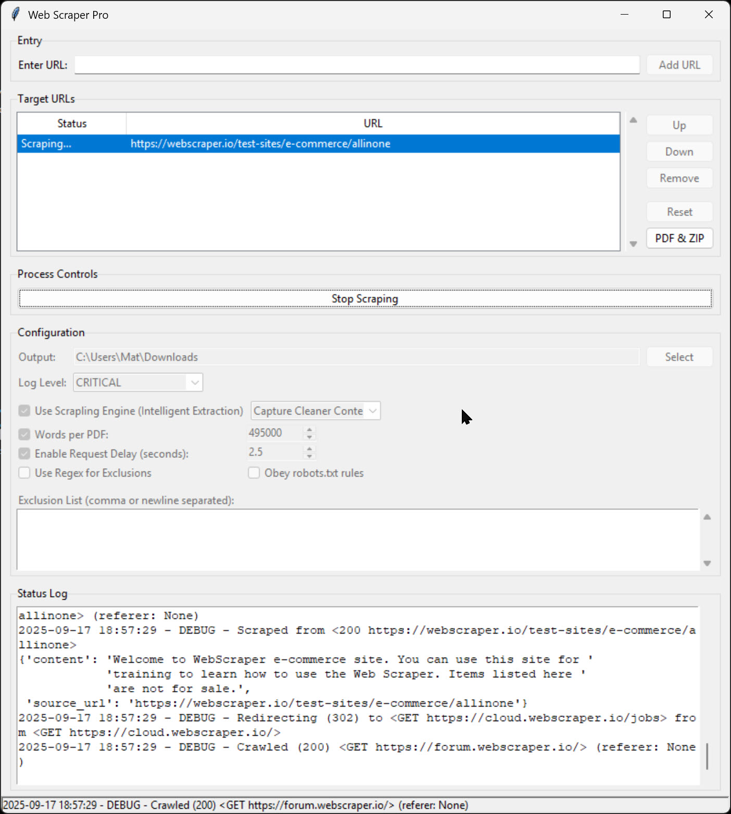

# Web Scraper Pro

A multi-process, queue-based web scraper with a Tkinter GUI, built for robust, configurable data extraction. The application leverages Scrapy for crawling and offers a choice between standard BeautifulSoup parsing and the intelligent `trafilatura` extraction engine.

## Features

* **Tkinter GUI**: A responsive user interface for managing a queue of target URLs, configuring settings, and monitoring logs in real-time.
* **Multi-Process Architecture**: The scraping and file packaging operations run in separate processes to prevent the GUI from freezing during intensive tasks.
* **Dual Scraping Engines**:
    * **Standard Engine**: Uses `BeautifulSoup` for basic text extraction.
    * **Scrapling Engine**: Utilizes `trafilatura` for intelligent, boilerplate-free content extraction with modes for precision vs. recall.
* **URL Queue Management**: Add, remove, and reorder URLs. The application processes them sequentially.
* **Automatic Data Packaging**: After scraping a domain, the tool automatically packages the extracted text content into:
    * **PDF Reports**: Combines text from multiple pages into one or more PDFs, with a configurable word count limit per file.
    * **ZIP Archives**: Creates a `.zip` file containing all raw `.txt` files, the `robots.txt` (if found), and a `progress.json` file.
* **Scrape Resumption**: Saves progress for each domain, allowing scraping to be stopped and resumed without re-downloading completed pages.
* **Configuration Control**:
    * **Output Directory**: Specify where to save the final PDF and ZIP files.
    * **Log Level**: Adjust logging verbosity from DEBUG to CRITICAL. The system intelligently silences noisy third-party libraries at higher log levels.
    * **Exclusion Lists**: Provide comma/newline-separated keywords or a regular expression to remove unwanted text from the results.
    * **Request Delays**: Set a configurable delay between requests to be polite to servers.
    * **Robots.txt**: Option to obey or ignore `robots.txt` rules.
* **Build Script**: Includes a `build.bat` script to automate the creation of a standalone Windows executable using PyInstaller.

## Technical Stack

* **GUI**: `tkinter`
* **Crawling**: `scrapy`
* **HTML Parsing/Extraction**: `BeautifulSoup4`, `trafilatura`
* **Concurrency**: `multiprocessing`
* **PDF Generation**: `reportlab`
* **HTTP Requests**: `requests`
* **Packaging**: `PyInstaller` (for the executable build)

## How It Works

1.  **Configuration**: The user sets the output directory and other scraping parameters in the GUI.
2.  **Add URLs**: URLs are added to a queue. The application validates each URL and fetches `robots.txt` if available.
3.  **Start Scraping**: The user starts the process. The application disables UI controls and begins processing the first pending URL in the queue.
4.  **Scrapy Sub-Process**: A new process is spawned to run the Scrapy spider, which crawls the target domain. Log messages are sent back to the main GUI process via a queue.
5.  **Data Saving**: The spider saves the extracted content of each page as a separate `.txt` file in a temporary folder.
6.  **Packaging Sub-Process**: Once scraping is complete for a domain, another process is spawned to package the results into PDF and ZIP files.
7.  **Cleanup**: The temporary folder containing the `.txt` files is deleted.
8.  **Loop**: The application moves to the next pending URL in the queue until all jobs are complete.

## Building from Source

The project is packaged into a standalone executable using `PyInstaller`. The `build.bat` script automates this process.

1.  Ensure Python 3.8+ is installed and in your system's PATH.
2.  Run the `build.bat` script from the command line.
3.  The script will:
    * Create a Python virtual environment (`venv`).
    * Install all required dependencies from PyPI.
    * Run `PyInstaller` with the correct settings to bundle the script and its dependencies into a single `.exe` file.
4.  The final executable will be located in the `dist/` directory.

The dependencies installed by the script are:
pip install scrapy beautifulsoup4 reportlab browser-cookie3 pyinstaller lxml cssselect parsel w3lib tldextract typing-extensions trafilatura dateparser htmldate justext

if __name__ == '__main__':
    # This just prints the content. In a real scenario, you might write it to a file.
    print(readme_content)
